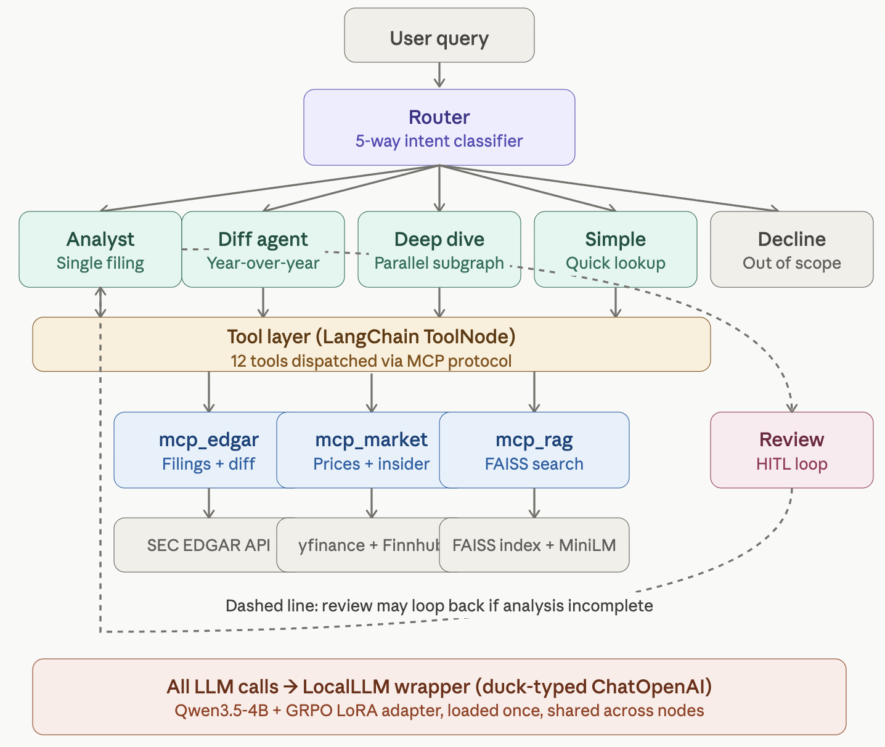

# Delta Filing

A SEC filing intelligence system built as a **multi-agent orchestrator with on-device LLM inference**. Routes user queries through specialized agents that call SEC EDGAR, market data, and a custom RAG component via MCP tools, then synthesizes the results — entirely without OpenAI dependency. Replaces GPT-4o-mini with a locally fine-tuned Qwen3.5-4B + LoRA adapter via a two-line drop-in.

## What it does

Given queries like:
- *"What are Apple's risk factors in their latest 10-K?"*
- *"How did Tesla's risk disclosures change from 2023 to 2024?"*
- *"Full analysis of NVIDIA — filings, market data, insider trades, news"*

…the system routes to the right agent, retrieves real SEC filings via EDGAR, augments with live market data and insider trades, optionally pulls semantically-similar passages from a fine-tuned RAG index, and produces an analytical summary with references to specific filing sections.

A human-in-the-loop reviewer can pause the analysis mid-flow and ask for more depth.

---

## Architecture



The system is a LangGraph state machine with 6 LLM-calling nodes, a tool dispatch layer over the MCP protocol, three independent MCP servers, and three backend data sources. Every LLM call goes through a single `LocalLLM` instance shared across nodes.

### Multi-agent orchestration (LangGraph)

A user query enters a 5-way **router** that classifies intent into one of:
- `FILING_ANALYSIS` — single-filing question
- `FILING_DIFF` — year-over-year comparison
- `COMPANY_DEEP_DIVE` — multi-source analysis
- `SIMPLE_QUERY` — quick factual lookup
- `OUT_OF_SCOPE` — outside SEC filing domain

Each route lands in a **specialized agent node**:

| Node | Path | Behavior |
|------|------|----------|
| `analyst` | FILING_ANALYSIS | Loops with tool calls until enough EDGAR data retrieved; then synthesizes |
| `diff_agent` | FILING_DIFF | Calls `diff_filing_sections` tool, narrates the year-over-year changes |
| `company_deep_dive` | COMPANY_DEEP_DIVE | **Subgraph**: parallel `financial` / `news` / `insider` agents fan out, then `synthesis` agent merges |
| `simple` | SIMPLE_QUERY | Quick lookup or short answer |
| `decline` | OUT_OF_SCOPE | Returns a fixed "out of scope" message, no LLM call |

Four of these (analyst, diff, deep-dive-internal, simple) form **agent–tool loops**: the agent emits a JSON tool call, the ToolNode dispatches via MCP, the tool result comes back as a `ToolMessage`, and the agent decides whether to call another tool or produce the final answer. LangGraph's `tools_condition` handles the routing.

### Human-in-the-loop review

After an analyst finishes, a **review node** evaluates the output via LLM-as-judge (using the same local model). If the analysis is judged shallow, the graph calls `interrupt()`:

- LangGraph **freezes the state** via the `MemorySaver` checkpointer
- The reviewer's suggestion is surfaced to the user (CLI prompt or web UI)
- User chooses `yes` (accept reviewer's instruction), `no` (skip and finish), or types a **custom improvement instruction**
- On user response, `interrupt()` resumes the graph from exactly where it stopped
- The user's instruction is injected back into the analyst's message history as a new `HumanMessage`

A `max_iterations=3` guard prevents infinite loops regardless of reviewer/user preference.

### Tool layer (MCP protocol)

Twelve tools are exposed via **three independent MCP servers**. Each server is a standalone process the agent connects to over MCP; the agent code is decoupled from tool implementations and any server can be swapped or extended independently.

| MCP Server | Tools | Backend |
|------------|-------|---------|
| `mcp_edgar` | `search_filings`, `get_filing_section`, `diff_filing_sections` | SEC EDGAR API + local cache |
| `mcp_market` | `stock_price`, `company_metrics`, `company_news`, `insider_trades`, `analyst_ratings`, `compare_stock_performance` | yfinance, Finnhub |
| `mcp_rag` | `search_filings_by_topic` | FAISS index over fine-tuned MiniLM embeddings |

The agent doesn't know how tools are implemented — it sees them as named functions with typed arguments. This is the value of MCP: protocol-level decoupling between the reasoning layer and the data layer.

### Backend data

- **SEC EDGAR** (`edgar.py`): direct HTTP to SEC's public API with a `USER_AGENT` header. Parses 10-K and 10-Q HTML to extract Item sections (1, 1A, 7, 7A, 8). All raw HTML cached locally to respect SEC rate limits and speed up repeat queries.
- **Cross-year diff** (`diff.py`): paragraph-level matching between two filings' same section. Identifies added, removed, and modified paragraphs — distinct functionality from generic text diff because it's structured around SEC section semantics.
- **Market data** (`market.py`): yfinance for prices and fundamentals, Finnhub for insider trades and analyst ratings.
- **RAG**: 351 SEC filing sections indexed in FAISS (384-d, `IndexFlatIP`), retrieved via a custom MiniLM-L6-v2 embedding model fine-tuned with InfoNCE on 2000 same-topic-different-company pairs.

### Local LLM substrate

All 6 LLM-calling nodes (router, analyst, diff, deep-dive sub-agents, simple, review) share a **single `LocalLLM` instance**. Loaded once at startup: Qwen3.5-4B base + GRPO LoRA adapter in 4-bit NF4, ~3.1 GB GPU/MPS footprint.

`local_llm.py` is duck-typed to match `langchain_openai.ChatOpenAI` — it implements `.invoke()` and `.bind_tools()` with the same return types. Swapping cloud LLM for the local one is a two-line change in `app.py`:

```python
from local_llm import LocalLLM
llm = LocalLLM(adapter_path="./adapters/grpo")
```

The wrapper handles three subtleties of inference with a fine-tuned model:
1. The SFT model sometimes fails to emit `<|im_end|>`. The wrapper passes `stop_strings=["\nuser\n", "\nassistant\n", "<|im_end|>"]` to `generate()` with a defensive `text.find()` fallback.
2. The model occasionally emits `section_id="Risk Factors"` instead of the SEC Item ID `"1A"`. A 14-entry `SECTION_NAME_TO_ID` map normalizes before tool dispatch.
3. SFT training data has no `tool` role. The wrapper converts `ToolMessage` to a `user` turn prefixed `[Tool result]`.

---

## Local fine-tuning: five-method alignment ablation

To make on-device inference work at the system's quality bar, I trained and compared **five alignment methods** on real SEC 10-K data. All adapters are LoRA (rank 8, alpha 16, q/k/v/o_proj) on Qwen3.5-4B in 4-bit NF4.

### Final scores (custom 87-test evaluation suite)

| Adapter | Method | Final score | Notes |
|---------|--------|-------------|-------|
| SFT | Supervised cross-entropy | 73/87 (84%) | Baseline |
| **DPO** | `-logσ(β·margin)` | **65/87 (75%)** | **Unbounded margin → catastrophic Review collapse (1/9)** |
| IPO | `(margin - 1/(2β))²` | 70/87 (80%) | Bounded margin via identity loss |
| cDPO | `-(1-ε)·logσ(m) - ε·logσ(-m)` | 69/87 (79%) | Label smoothing |
| **GRPO** | RL with k3 KL estimator | **76/87 (87%)** ★ | **Deployed in production** |

Six loss functions implemented from scratch: DPO, IPO, cDPO, GRPO, InfoNCE (for embedding training), SFT retention.

### Finding 1: alignment-tax severity tracks objective boundedness

The three preference-optimization methods (DPO, IPO, cDPO) train on **identical data** with **identical hyperparameters** — only the loss function differs. They give different results in a predictable order:

- **DPO** (unbounded `-logσ(β·margin)`): during training, the implicit reward margin grew from 0.02 at step 10 to **8.76 at step 520 — a 440× increase**. The resulting model collapsed on rigid-format tasks (Review 1/9, Refusal 3/6) while still scoring 8/8 on JSON tool parsing. It's not a capability collapse — it's a strategy shift induced by the unbounded objective.
- **IPO** (bounded `(margin - 1/(2β))²`): margin held near the target value 1.0 (= `1/(2β)` with β=0.5). Lost 3 points on tool-calling, kept Review at 7/9.
- **cDPO** (label smoothing): partial protection against extreme margins; Review at 6/9.

GRPO, training on the same data and same LoRA rank but with an **explicit multi-objective reward function** (tool-call validity + section reference + numerical specificity + analytical judgment + format compliance), holds 15/15 on tool calling *and* leads on synthesis (7/8 vs SFT's 5/8). It avoids the trade-off entirely.

**Interpretation**: the popular framing — *"LoRA has a small parameter budget, so alignment must trade off against base capabilities"* — is testable, and the test refutes the strong version of the claim. Same LoRA rank, same data; only the optimization signal changed. The trade-off isn't in the parameter budget. It's in the optimizer's incentive structure.

### Finding 2: KL-divergence implementation bug in GRPO

The initial GRPO implementation used `kl = pi_log_prob - ref_log_prob`. **This is the log-ratio, not KL.** A single-sample log-ratio can be negative whenever the policy probability drops below the reference — which happens routinely during learning. With `β · kl` added to the loss, a negative `kl` *rewards* divergence from the reference SFT model.

Training log evidence:
```
Step  5  | pg= 0.107 | kl= +0.0011
Step 10  | pg= 0.227 | kl= -0.0014   ← already negative
Step 25  | pg=-0.083 | kl= -0.0848
Step 50  | pg=-0.161 | kl= -0.8945   ← strongly negative
```

The policy drifted away from SFT, lost learned capabilities, scored **66/87** (worse than SFT baseline).

**Fix**: the Schulman 2020 k3 estimator:
```python
log_ratio = ref_log_prob - pi_log_prob
log_ratio = torch.clamp(log_ratio, -10, 10)
kl = torch.exp(log_ratio) - 1 - log_ratio
```

k3 is always non-negative (a property of the exponential's Taylor expansion) and unbiased.

After the fix, **KL stayed in [0, 0.0006]** throughout training. The same data, same hyperparameters, same reward function produced a final score of **76/87 — a +10 improvement**, the single largest delta in the project. The KL bug was the only change.

### Finding 3: continuous metrics beat binary pass/fail

The Red flag category includes *false-positive tests* — asking the model to find red flags in **healthy companies** (JNJ, PG, V). All adapters fail binary thresholds, so we measured **alarm word count** instead:

| Company | SFT | DPO | IPO | cDPO | GRPO |
|---------|-----|-----|-----|------|------|
| JNJ     | 4   | 3   | 6   | 9    | 5    |
| PG      | 4   | 4   | 5   | 5    | 3    |
| V       | 4   | 6   | 4   | 8    | 7    |
| **Avg** | **4.0** | 4.3 | 5.0 | **7.3** | 5.0 |

cDPO over-alarms ~2× as much as SFT — the cleanest quantitative signal of alignment tax in the project. Binary pass/fail at threshold ≤3 alarm words hides this completely.

### Full per-category breakdown

| Category          | SFT    | DPO    | IPO    | cDPO   | GRPO   |
|-------------------|--------|--------|--------|--------|--------|
| Router            | 10/11  | 8/11   | 10/11  | 9/11   | 10/11  |
| Tool calling      | **15/15** | 14/15 | 12/15 | 12/15  | **15/15** |
| Tool parsing      | 6/8    | **8/8** | **8/8** | 6/8  | 6/8     |
| Review            | 8/9    | **1/9 ⚠** | 7/9 | 6/9    | 8/9     |
| Synthesis         | 5/8    | 6/8    | 5/8    | 6/8    | **7/8** |
| Section summary   | 7/8    | 7/8    | 7/8    | **8/8** | 7/8     |
| Red flag          | 7/10   | **8/10** | 7/10 | 7/10   | **8/10** |
| Change detection  | 6/8    | 7/8    | 6/8    | **8/8** | 6/8     |
| Refusal           | **6/6** | 3/6   | 5/6    | 5/6    | **6/6** |
| Robustness        | 3/4    | 3/4    | 3/4    | 2/4    | 3/4     |
| **Total**         | **73** | **65** | **70** | **69** | **76**  |

DPO's pattern is the diagnostic: Tool parsing 8/8 (best in suite) + Review 1/9 (collapse) in the same model rules out a capability loss. The model can still generate complex JSON and analytical paragraphs but cannot emit `COMPLETE` as a one-word binary classification. Unbounded margin growth pushed the output distribution toward verbose analytical mode until rigid-format outputs became out of distribution.

---

## Custom 87-test evaluation suite

Built from scratch because standard benchmarks don't exercise the system's failure modes. Ten categories aligned to the LangGraph node responsibilities:

| Category | Tests | What it measures |
|----------|-------|------------------|
| Router | 11 | 5-way intent classification accuracy |
| Tool calling | 15 | JSON tool-call generation, correct tool name + arguments |
| Tool parsing | 8 | Extracting fields from tool results into analysis |
| Review | 9 | Binary `COMPLETE` / `NEEDS_FOLLOW_UP` classification (rigid format) |
| Synthesis | 8 | Multi-source data integration (filings + market + insider) |
| Section summary | 8 | Section-specific analysis with references and judgment |
| Red flag | 10 | Risk detection (7 true positive + 3 deliberate false positives) |
| Change detection | 8 | Year-over-year diff narration |
| Refusal | 6 | Refusing investment advice / price predictions |
| Robustness | 4 | Stability under input perturbations (typos, casing, verbosity) |

Each test is hand-written with a hard-coded expected pattern. Judging is **rule-based** (keyword presence, JSON parsing, length thresholds) — no LLM-as-judge — for determinism and reproducibility.

---

## Performance and limitations

- **Inference speed**: 5.6 tokens/sec on M1 Max MPS (flash-attention not available for Qwen3.5 on Apple Silicon). Full deep-dive query takes 1–3 minutes. On A100 the same model runs at ~80 tok/s; via llama.cpp + GGUF on M1 Max, ~30–40 tok/s. The trained adapter is identical — only inference is slow.
- **Tool role gap**: SFT training data has no `tool`-role messages. The wrapper handles this via `[Tool result]` prefix on user turns — works in practice but not the cleanest design.
- **`tool_calling` ceiling effect**: SFT and GRPO both score 15/15, so the category can't differentiate top adapters. Would need ambiguous-intent cases to break the tie.
- **SFT retention loss mask**: computes cross-entropy over the full sequence rather than just assistant tokens, diluting the retention signal. Likely amplified the IPO/cDPO alignment tax magnitudes. Not fixed in this version.
- **Single-seed results**: GRPO_v2's +10 over SFT is striking but a single seed. Multi-seed runs would bound the variance estimate.

---

## Quick start

```bash
pip install -r requirements.txt

# Set up SEC EDGAR / Finnhub / FRED API keys
cp .env.example .env
# Edit .env

# Build the RAG index (one-time, ~1 minute)
python generate_embedding_data.py
python train_embedding.py --train      # ~5 min on CPU/MPS
python build_index_from_sft.py         # ~1 min

# Run the agent
python app.py
```

Inference runs at ~5.6 tokens/sec on M1 Max MPS. Typical query latency: 30 seconds for routing, 1–3 minutes for a full multi-source analysis.

---

## Project structure

```
delta-filing/
├── app.py                       # LangGraph orchestrator (router, agents, review, subgraph)
├── local_llm.py                 # LocalLLM wrapper — drop-in for ChatOpenAI
├── edgar.py / diff.py / market.py     # Backend data layer
├── mcp_edgar.py / mcp_market.py / mcp_rag.py    # Three MCP servers
├── adapters/
│   ├── sft_pytorch/             # SFT adapter (73/87)
│   ├── dpo_pytorch/             # DPO adapter (65/87, demonstrates collapse)
│   ├── dpo_ablation/            # IPO + cDPO from controlled ablation
│   └── grpo/                    # GRPO adapter (76/87, deployed) ★
├── training_data/               # SFT + DPO preference pairs + embedding pairs
├── train_sft_kaggle.py          # SFT (Kaggle T4×2, ~7h)
├── train_dpo.py                 # DPO standalone
├── train_grpo_kaggle.py         # GRPO with k3 KL estimator
├── train_embedding.py           # MiniLM-L6-v2 InfoNCE
├── faiss_index/                 # 351-vector RAG index
├── models/financial_embeddings/ # Fine-tuned MiniLM weights
├── notebook/kaggle/             # 9 Kaggle training/eval notebooks
├── notebook/kaggle_output/      # Training logs (incl. GRPO v1/v2 KL evidence)
├── test_generator/              # 87-test suite generator + runner
└── test/                        # Local pytest smoke suite
```

---

## Acknowledgments

- Base model: [Qwen/Qwen3.5-4B](https://huggingface.co/Qwen/Qwen3.5-4B)
- Embedding base: [sentence-transformers/all-MiniLM-L6-v2](https://huggingface.co/sentence-transformers/all-MiniLM-L6-v2)
- KL k3 estimator: [Schulman, "Approximating KL Divergence" (2020)](http://joschu.net/blog/kl-approx.html)
- IPO loss reference: [Azar et al., "A General Theoretical Paradigm to Understand Learning from Human Preferences" (2023)](https://arxiv.org/abs/2310.12036)
- GRPO reference: [DeepSeek-R1 paper](https://arxiv.org/abs/2501.12948)
- Training infrastructure: Kaggle T4 (free tier)
- Data source: SEC EDGAR
